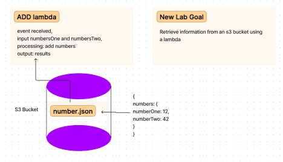
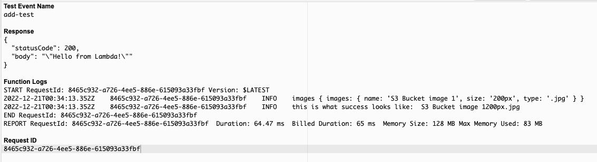

# lambda-lab-17

[images.json](./images.json)

## Challenge

- Create an S3 Bucket with “open” read permissions, so that anyone can see the images/files in their browser

- A user should be able to upload an image at any size, and update a dictionary of all images that have been uploaded so far

- When an image is uploaded to your S3 bucket, it should trigger a Lambda function which must:
Download a file called “images.json” from the S3 Bucket if it exists

- The images.json should be an array of objects, each representing an image. Create an empty array if this file is not present

- Create a metadata object describing the image
Name, Size, Type, etc.

- Append the data for this image to the array
Note: If the image is a duplicate name, update the object in the array, don’t just add it

- Upload the images.json file back to the S3 bucket

## How to Use Lambda

### S3
1. Create a bucket and give it a unique name
2. Choose a region closest to you
3. Disable ACL's
4. Remove "block all public access" selection
5. Disable bucket versioning
6. Disable default encryption
7. No advanced settings necessary
8. Select create bucket
9. Upload package.json file(doesn’t need to be zipped)

10. Navigate to the permissions tab
11. Edit bucket policy, and “Add new statement” 
12. Change principal to global “*”
13. Add the bucket name to the resource [“amawss3::camilla-rees-lab”]
14. Add getObjects action to policy. Find by searching s3
15. Add putObjects action to policy. Find by searching s3
16. Save changes if no warnings or errors

### IAM
1. Add permission to user: AmazonS3FullAccess and Lambda full access

### Lambda
1. Create a function
2. Node.js 16x runtime
3. Select xB6_64 architecture if Mac does not have m1 chip, Arm64 if it has the m1 chip
4. Permissions: all default
5. Execution role: create a new role

- Add code to get stuff out of the bucket with key and params

6. Configure: Test new event
7. Event sharing settings: shareable
8. In Event JSON, Records at level 0, S3, Bucket name
9. Run test
10. Upload images.json file and check for success again - find upload button inside bucket

### Trigger Configuration
1. S3 source
2. Bucket name
3. All object create events event type
4. Acknowledge risk

### Debugging
1. View logs in monitor on cloudwatch for debugging and to see success

## Issues Encountered
- One issue encountered was getting the json file structure wrong the first time. I forgot to include records at level 0, and put the image properties inside the images object.

### Credits and Collaborations
- [401d49 Lambda Demo Code]()
